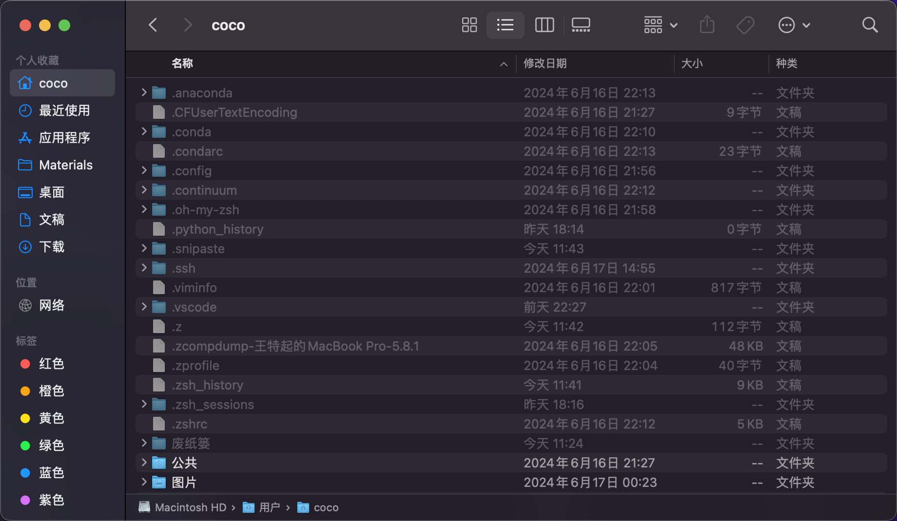

# MacOS系统设置

## 抹盘重装当前版本Monterey

1. 重启后 ==按住== ++command++ + <kbd>R</kbd>，进入MacOS恢复界面

	

2. 输入密码后，点击 ==磁盘工具==

	

3. 点击左上角 ==显示->显示所有设备==

	

4. 点到 ==容器disk3==，然后点击右上方的 ==抹掉==

	

5. 保持名称 ==Macintosh HD==，格式 ==APFS== 不变，点击抹掉

	

6. 点击完成后，擦盘已抹除，退回到Macos恢复页面，点击 ==重新安装macOS Monterey==

	

## MacOS的开机设置

1. 分析和文件保险箱磁盘加密可以取消勾选， ==不要跳过iCloud登陆==

2. 程序坞与菜单栏设置

	

	- 菜单栏图标

		

3. 调度中心的触发角设置

	

4. 在 ==辅助功能->指针控制->触控板选项==，点击启用三指拖移

	

5. 触控板内的选项全部勾选

6. 访达的偏好设置，显示路径++option++ + ++command++ + <kbd>P</kbd>

	- 通用

		

	- 边栏

		

	- 高级

		

7. 图标排序

	

	
	
	隐藏文件：
	
	
