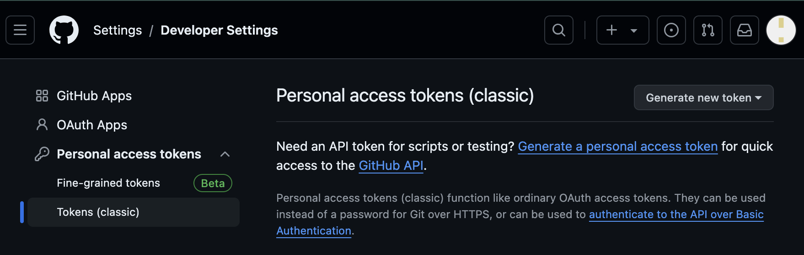
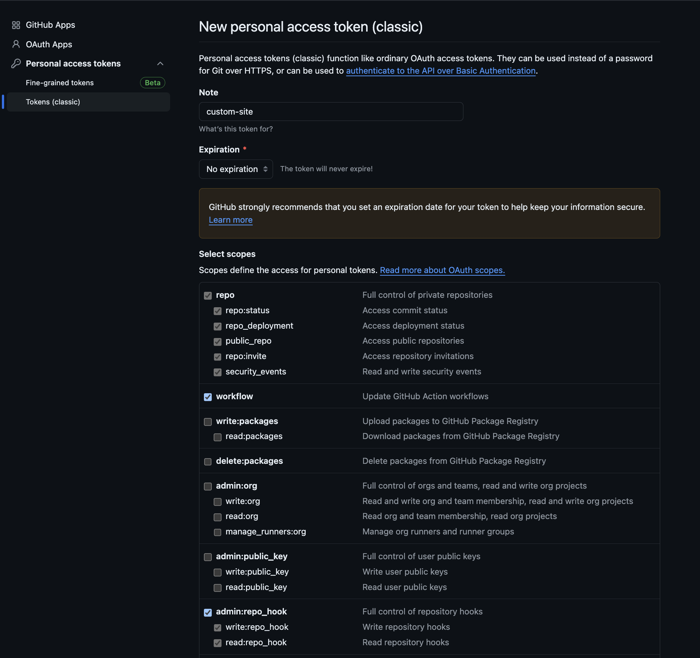
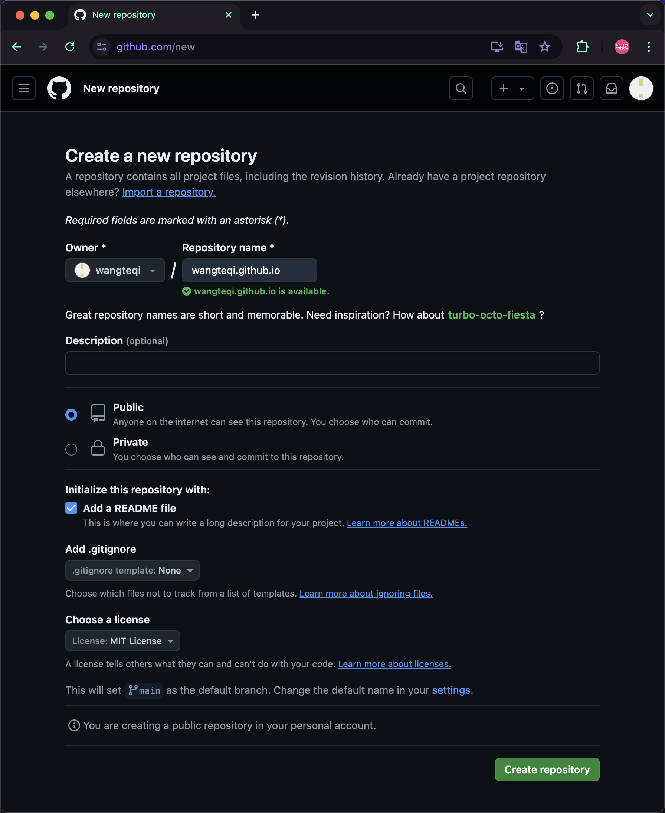
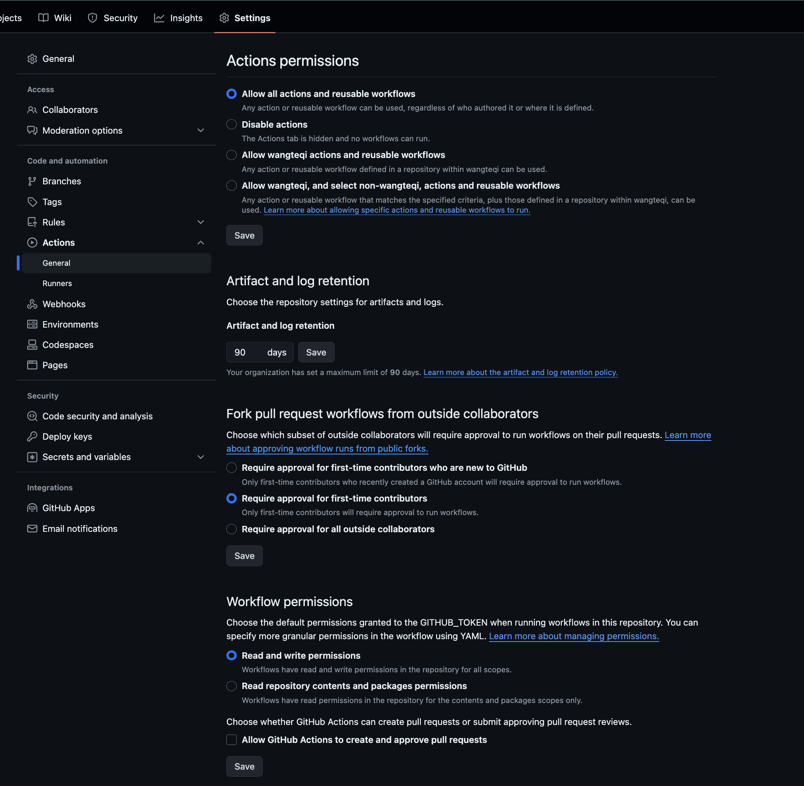
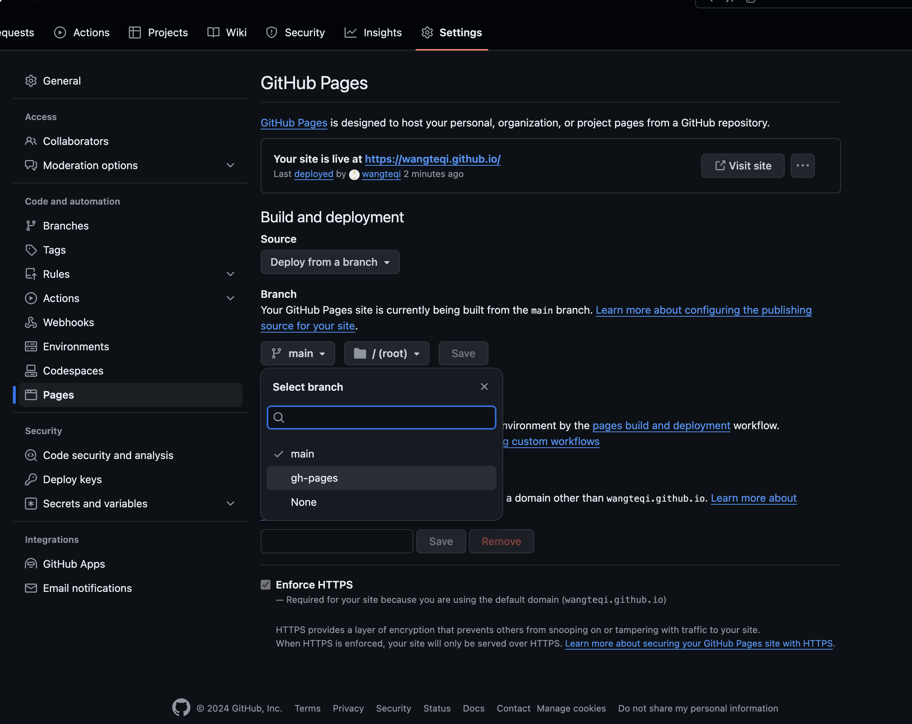

# Github中的配置

## 令牌创建

在Github上[创建令牌](https://github.com/settings/tokens/new)，点击 ==Generate new token==

相关选项

- Note: custom-site
- Expiration: No expiration
- Select scopes: repo, workflow, repo_hook

## 仓库创建

1. 在Github上[创建仓库](https://github.com/new)，点击 ==Create repository==

	

2. 随后在[Action设置](https://github.com/wangteqi/wangteqi.github.io/settings/actions)中，调整 ==Workflow permission==

	

3. 最后部署完之后，在[Page设置](https://github.com/wangteqi/wangteqi.github.io/settings/pages)中，把Branch调整到 ==gh-page== 分支

	