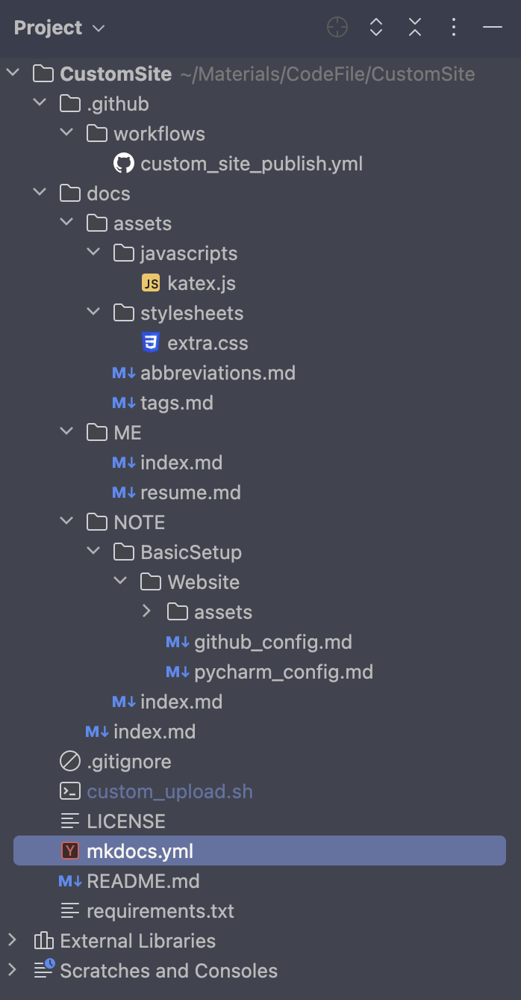

# Pycharm中的配置

## 整体结构



## 脚本文件的配置

文件路径：./custom_upload.sh

1. 首先创建脚本文件:

	```shell
	touch ./custom_upload.sh
	## 方法一：使用sh运行脚本
	sh custom_upload.sh
	## 方法二：增加可执行权限 （个人使用方法二）
	chmod u+x ./custom_upload.sh
	# 直接使用./custom_upload.sh运行脚本
	./custom_upload.sh
	```

2. 编辑脚本文件内容：

	- 创建忽略文件，将[忽略文件的配置](#忽略文件的配置)复制到里面

		```shell
		touch .gitignore
		```

	- 创建依赖文件，将[依赖文件的配置](#依赖文件的配置)复制到里面

		```shell
		touch requirements.txt
		```

	- 创建Mkdocs文件，将[Mkdocs文件的配置](#mkdocs文件的配置)复制到里面

		```shell
		# 一定要先创建完依赖文件，才能安装mkdocs-material的包
		pip3 install -r requirements.txt
		# 初始化mkdocs项目（要先安装完对应的包）
		mkdocs new .
		```

	- 创建工作流文件，将[工作流文件的配置](#工作流文件的配置)复制到里面

		```shell
		# 创建工作流文件所在目录
		mkdir -p .github/workflows
		touch .github/workflows/custom_site_publish.yml
		```

	- 创建附加文件

		- 创建js文件，将[js文件的配置](#js文件的配置)复制到里面

			```shell
			# 创建js文件所在目录
			mkdir -p docs/assets/javascripts
			touch docs/assets/javascripts/katex.js
			```

		- 创建css文件，将[css文件的配置](#css文件的配置)复制到里面

			```shell
			# 创建css文件所在目录
			mkdir -p docs/assets/stylesheets
			touch docs/assets/stylesheets/extra.css
			```

		- 创建缩略词文件，将[缩略词文件的配置](#缩略词文件的配置)复制到里面

			```shell
			touch docs/assets/abbreviations.md
			```

		- 创建标签文件，将[标签文件的配置](#标签文件的配置)复制到里面

			```shell
			touch docs/assets/tags.md
			```

	- 初始化仓库

		```shell
		# 初始化本地仓库
		git init
		# 添加全部文件到暂存区
		git add .
		# 提交暂存区内容到本地仓库
		git commit -m "init"
		# 添加远程仓库
		git remote add origin https://github.com/wangteqi/wangteqi.github.io.git
		# 从远程更新仓库的本地版本 
		git pull --rebase origin main
		# 推送到远程仓库 (第一次推送时需要输入账号：邮箱，密码：令牌)
		git push -u origin main
		```

	- Git提交修改的代码（最终只需这一步）

		```shell
		# 查看文件当前状态
		git status
		# 添加全部文件到暂存区
		git add .
		# 提交暂存区内容到本地仓库
		git commit -m "init"
		# 从远程更新仓库的本地版本
		git pull --rebase origin main
		# 推送到远程仓库
		git push -u origin main
		```
	
3. 完整的脚本文件内容

	```shell
	# Step1: 创建忽略文件和依赖文件
	touch .gitignore
	touch requirements.txt
	
	# Step2: 安装mkdocs-material，并初始化Mkdocs项目
	pip install -r requirements.txt
	mkdocs new .
	
	# Step3: 创建相关文件（工作流文件，附加文件）
	mkdir -p .github/workflows
	touch .github/workflows/custom_site_publish.yml
	mkdir -p docs/assets/javascripts
	touch docs/assets/javascripts/katex.js
	mkdir -p docs/assets/stylesheets
	touch docs/assets/stylesheets/extra.css
	touch docs/assets/abbreviations.md
	touch docs/assets/tags.md
	
	# Step4：初始化仓库
	git init
	git add .
	git commit -m "init"
	git remote add origin https://github.com/wangteqi/wangteqi.github.io.git
	git pull --rebase origin main
	git push -u origin main
	
	# Step5：提交修改的代码（后续提交只需要这一步骤，其余步骤内容注释掉）
	git status
	echo "-----------------------------------------------------"
	git add .
	git commit -m "init"
	git pull --rebase origin main
	git push -u origin main
	```

## 忽略文件的配置

- [.gitignore规则不生效](https://www.benhailong.com/?p=545)
	.gitignore只能忽略那些Untracked的文件，如果某些文件已经被纳入了版本管理中，则修改.gitignore是无效的。

	解决方法：删除本地缓存（改变成Untrack状态）

	```shell
	git rm -r --cached .
	```

- 文件路径：./.gitignore

- 文件内容

	```
	# macos文件
	.DS_Store
	
	# pycharm文件
	.idea/
	
	# 使用mkdocs build产生的网站文件
	site/
	
	# 脚本文件
	custom_upload.sh
	```

## 依赖文件的配置

- 需要用到的包名，如mkdocs-material

- 文件路径：./requirements.txt

- 文件内容

	```
	mkdocs-material
	```

## Mkdocs文件的配置

- 配置Material主题

- 相关资料

	- [Material for Mkdocs文档说明](https://squidfunk.github.io/mkdocs-material/)
	- [表情查询](https://squidfunk.github.io/mkdocs-material/reference/icons-emojis/#search)
	- [PyMdown Extension的文档说明](https://facelessuser.github.io/pymdown-extensions/)

- 文件路径: ./mkdocs.yml

- 文件内容

	```yaml
	# 网站名字
	site_name: 王特起的个人网站
	# 网站地址
	site_url: https://wangteqi.github.io
	# 网站作者
	site_author: 王特起
	# 网站描述
	site_description:
	  王特起的个人网站说明：
	  （标签修改需要更新2处内容icon里的tag, extra里的tags），
	  （添加文档需要更新nav中的内容），
	  （添加文档状态图标需要更新extra中status的内容）。
	  参考文档：
	  （https://squidfunk.github.io/mkdocs-material/），
	  （https://facelessuser.github.io/pymdown-extensions/）
	
	
	# GitHub 仓库
	repo_name: wangteqi.github.io     # 仓库名称
	repo_url: https://github.com/wangteqi/wangteqi.github.io  # 仓库url地址
	edit_uri: edit/main/docs  # 跳转至GitHub修改Markdown源文件
	
	# 左下角的版权声明
	copyright: Copyright &copy; 2024 ~ now |  🫥 王特起 (QiQ_iQi)
	
	## 主题配置
	theme:
	  # 主题名称
	  name: material            # 启用material主题
	  # 更改主题的整体外观
	  palette:
	    # 跟随系统主题
	    - media: "(prefers-color-scheme)"
	      toggle:
	        icon: fontawesome/solid/star-half-stroke
	        name: System preference
	    # 浅色主题
	    - media: "(prefers-color-scheme: light)"
	      scheme: default       #浅深主题
	      primary: deep purple       #主题色, 标题、侧边栏、文本链接
	      accent: deep orange   #强调色, 悬停的链接、按钮和滚动条
	      toggle:
	        icon: material/weather-sunny  # 组件图标
	        name: Light                   # 组件名称
	    # 深色主题
	    - media: "(prefers-color-scheme: dark)"
	      scheme: slate
	      primary: blue grey
	      accent: deep orange
	      toggle:
	        icon: material/weather-night
	        name: Dark
	  # 字体设置
	  font:
	    text: Monaco
	    code: Monaco
	  # 语言设置
	  language: 'en' #网页的语言
	  # 图标 (搜索图标的链接: https://squidfunk.github.io/mkdocs-material/reference/icons-emojis/#search)
	  icon:
	    logo: fontawesome/brands/github-alt    # 网页的图标
	    repo: fontawesome/brands/github        # github仓库的图标
	    tag: # 标签的图标（需要更新tag）
	      me_icon: simple/aboutdotme
	  # 功能
	  features:
	    # 导航的设置
	    - navigation.tracking    # URL锚点跟踪
	    - navigation.tabs        # 显示顶层导航栏标签页
	    - navigation.tabs.sticky # 顶层导航栏标签页始终可见
	    - navigation.expand      # 展开左侧导航栏
	    - navigation.indexes     # 提供标签页的概述页面
	    - toc.follow             # 目录跟随
	    - navigation.top         # 返回顶部，在上滑时出现
	    - navigation.footer      # 底部导航栏
	    # 网站搜索的设置
	    - search.suggest         # 搜索输入一些字母时推荐补全整个单词
	    - search.highlight       # 搜索出的文章关键词加入高亮
	    # 代码的设置
	  #    - content.action.view    # 查看源码
	  #    -  content.action.edit   # 编辑源码
	    - content.code.copy      # 复制代码
	    - content.code.annotate  # 代码悬浮注释
	    # 内容选项卡设置
	    - content.tabs.link      # 同步联结并联的内容选项卡
	    # 链接注释
	    - content.tooltips       # 设置链接名称
	
	
	## markdown扩展
	markdown_extensions:
	  # Python Markdown包
	  - abbr       # 缩略词  *[HTML]: Hyper Text Markup Language
	  - admonition # 突出显示提示框  !!! note
	  - attr_list  # 属性列表（注释，按钮，颜色......）
	  - def_list   # 自定义列表
	  - footnotes  # 脚注
	  - md_in_html # 允许在html中使用markdown语法
	  - toc: # 目录
	      title: 目录    # 网页语言为英语时设置（非必须）
	      permalink: 👻 # 永久链接，固定标题位置为当前链接位置
	      permalink_title: Permanent link # 永久链接悬停标题
	      # 使链接URL更易读
	      slugify: !!python/object/apply:pymdownx.slugs.slugify
	        kwds:
	          case: lower
	  - tables     # 表格
	  # Python Markdown Extension包
	  - pymdownx.arithmatex: # 数学公式
	      generic: true
	  - pymdownx.betterem:   # 允许嵌套使用粗体斜体
	  - pymdownx.caret       # 符号 ^,^^
	  - pymdownx.tilde       # 符号 ~,~~
	  - pymdownx.mark        # 符号 ==
	  - pymdownx.details     # 折叠突出显示提示框 ??? note
	  - pymdownx.emoji: # 表情 :smile:
	      emoji_index: !!python/name:material.extensions.emoji.twemoji
	      emoji_generator: !!python/name:material.extensions.emoji.to_svg
	  - pymdownx.superfences: # 允许代码和内容块之间任意嵌套
	  - pymdownx.highlight: # 在嵌套的基础上代码高亮
	      pygments_lang_class: true # 个性化不同语言的高亮（非必须）
	      auto_title: true    # 添加标题
	      linenums: true      # 显示行号 或指定起始行号,高亮某些行
	      linenums_style: pymdownx-inline # 行号样式
	  - pymdownx.inlinehilite  # 行内代码高亮
	  - pymdownx.keys        # 键盘键 ++ctrl+alt+del++
	  - pymdownx.smartsymbols # 智能符号 (c)
	  - pymdownx.snippets: # 将任意文件中的内容嵌入到文档中（主目录是CustomSite）
	      auto_append:
	        - docs/assets/abbreviations.md # 缩略词
	  - pymdownx.tabbed: # 并列内容选项卡
	      alternate_style: true
	      # 使选项卡的跳转链接更易读
	      slugify: !!python/object/apply:pymdownx.slugs.slugify
	        kwds:
	          case: lower
	  - pymdownx.tasklist: # 复选列表
	      custom_checkbox: true
	
	
	## 自定义javascript
	extra_javascript:
	  # 数学公式
	  - assets/javascripts/katex.js
	  - https://unpkg.com/katex@0/dist/katex.min.js
	  - https://unpkg.com/katex@0/dist/contrib/auto-render.min.js
	
	
	## 自定义css
	extra_css:
	  # 数学公式
	  - https://unpkg.com/katex@0/dist/katex.min.css
	  # 自定义字体...样式
	  - assets/stylesheets/extra.css
	
	
	## 插件
	plugins:
	  # 搜索功能
	  - search:
	      lang:
	        - zh
	        - en
	        - ja
	      separator: '[\s\u200b\-,:!=\[\]()"/]+|(?!\b)(?=[A-Z][a-z])|\.(?!\d)|&[lg]t;'
	  # 标签功能
	  - tags:
	      tags_file: assets/tags.md
	
	
	## 额外配置项
	extra:
	  # 社交账号
	  social:
	    - name: Github | wangteqi
	      icon: fontawesome/brands/github
	      link: https://github.com/wangteqi
	    - name: QQ | 1591700776
	      icon: fontawesome/brands/qq
	      link: https://wangteqi.github.io/主页/
	    - name: Bilibili | wangteqi
	      icon: fontawesome/brands/bilibili
	      link: https://space.bilibili.com/70766963
	  # 文档状态 （需要更新status）
	  status:
	    new: Recently Add
	    news: Recently Add
	    deprecated: Removed
	  # 标签    （需要更新tags）
	  tags:
	    关于我: me_icon
	
	
	## 导航栏  （需要更新nav）
	not_in_nav: |   # 不在导航栏中的文件
	  index.md
	  assets/abbreviations.md
	nav: # 在导航栏中的文件
	  - 我: # 使用index.md说明该标签页的概述
	      - ME/index.md
	      - 个人简介: ME/resume.md
	  - 笔记:
	      - NOTE/index.md
	      - MacOS设置:
	          - 系统偏好设置: NOTE/MacOS/system_config.md
	          - 常用软件设置: NOTE/MacOS/software_config.md
	      - 个人网站搭建:
	          - Github中的配置: NOTE/Website/github_config.md
	          - Pycharm中的配置: NOTE/Website/pycharm_config.md
	  - 标签:
	      - assets/tags.md
	```

## 工作流文件的配置

- 官方配置文档：[Material for Mkdocs-Github Action](https://squidfunk.github.io/mkdocs-material/publishing-your-site/#with-github-actions)，[Github官网文档](https://docs.github.com/zh/actions/learn-github-actions/understanding-github-actions?learn=getting_started&learnProduct=actions)

- 相关资料

	- [Action的相关教程](https://zhsher.cn/posts/7339/index.html)
	- [Action使用缓存](https://hailangya.com/articles/2021/12/17/github-actions-cache/)
	- [pip的cache路径](https://github.com/actions/cache/blob/main/examples.md#python---pip)
	- [Github Action Bot的使用](https://nolebase.ayaka.io/%E7%AC%94%E8%AE%B0/%F0%9F%9B%A0%EF%B8%8F%20%E5%BC%80%E5%8F%91/%F0%9F%9F%A2%20%E6%8C%81%E7%BB%AD%E9%9B%86%E6%88%90%20%E6%8C%81%E7%BB%AD%E4%BA%A4%E4%BB%98%20CICD/GitHub%20Actions/%E4%BB%93%E5%BA%93%E5%86%85%E7%9A%84%20GitHub%20Actions%20%E5%B7%A5%E4%BD%9C%E6%B5%81%E4%BD%BF%E7%94%A8%20GitHub%20Actions%20Bot%20%E6%9D%A5%E6%8F%90%E4%BA%A4.html#%E4%BB%93%E5%BA%93%E5%86%85%E7%9A%84-github-actions-%E5%B7%A5%E4%BD%9C%E6%B5%81%E4%BD%BF%E7%94%A8-github-actions-bot-%E6%9D%A5%E6%8F%90%E4%BA%A4)

- 文件路径：./.github/workflows/custom_site_publish.yml

- 文件内容

	```yaml
	# 定义工作流名称
	name: custom-site-publish
	# 触发条件
	on:
	  push: # 这个工作流会在每次向仓库main分支推送代码时触发
	    branches:
	      - main
	## 构建工作流中的任务
	jobs:
	  # 任务名称
	  deploy:
	    # 指定环境
	    environment: mkdocs-deploy
	    # 指定了运行该任务的虚拟环境是最新版本的Ubuntu
	    runs-on: ubuntu-latest
	    # 执行步骤
	    steps:
	      ## 推送到Github上
	      # 检出代码到运行工作流的虚拟环境中
	      - name: Checkout repository  # 动作名称
	        uses: actions/checkout@v4  # 动作
	      # 配置Git凭证，由GitHub Actions Bot完成后续的提交操作
	      - name: Configure Git Credentials
	        run: |
	          git config user.name "github-actions[bot]"
	          git config user.email "41898282+github-actions[bot]@users.noreply.github.com"
	      # 自动设置python环境
	      - name: Setup Python
	        uses: actions/setup-python@v5
	        with: # 指定版本参数
	          python-version: 3.x
	      ## 使用缓存更快的下载相关包
	      # 缓存文件
	      - name: Cache modules
	        # 使用缓存action
	        uses: actions/cache@v4
	        with:
	          # 需要缓存的文件的路径
	          path: ~/.cache/pip
	          # 对缓存的文件指定的唯一表示
	          key: ${{ runner.os }}-pip-${{ hashFiles('**/requirements.txt') }}
	          # 当 key 没有命中缓存时，用于恢复缓存key值的有序列表
	          restore-keys: |
	            ${{ runner.os }}-pip-
	      ## 安装相关依赖包
	      # 使用包管理工具pip安装 mkdocs-material
	      - name: Install dependencies
	        run: pip install -r requirements.txt
	      ## 部署网站
	      # 使用 mkdocs-material 构建网站并部署到 gh-pages 分支
	      - name: Deploy to gh-pages
	        run: mkdocs gh-deploy --force
	```

## 主页index文件的配置

```markdown
# 👋

你好

这里是王特起的主页 :simple-homepage:

（待完善）

## 板块

- [关于我](ME/index.md)：关于我的一些资料

- [内容标签](assets/tags.md)：标签

## 功能

1. 基础配置

	- [ ] MacOS
	- [ ] Typora
	- [ ] Royal tsx
```

## 附加文件的配置

### js文件的配置

- [支持数学公式](https://squidfunk.github.io/mkdocs-material/reference/math/#katex-docsjavascriptskatexjs)

- 文件路径：./docs/assets/javascripts/katex.js

- 文件内容

	```js
	// 数学公式katex
	document$.subscribe(({ body }) => {
	  renderMathInElement(body, {
	    delimiters: [
	      { left: "$$",  right: "$$",  display: true },
	      { left: "$",   right: "$",   display: false },
	      { left: "\\(", right: "\\)", display: false },
	      { left: "\\[", right: "\\]", display: true }
	    ],
	  })
	})
	```

### css文件的配置

- 自定义样式，如[自定义文档状态图标](https://squidfunk.github.io/mkdocs-material/reference/#setting-the-page-status)

- 文件路径：./docs/assets/stylesheets/extra.css

- 文件内容

	```css
	/*自定义样式*/
	:root {
	    /*文档状态的图标*/
	    --md-status--news: url('data:image/svg+xml;charset=utf-8,<svg xmlns="http://www.w3.org/2000/svg" viewBox="0 0 24 24"><path d="M20 4c1.11 0 2 .89 2 2v12c0 1.11-.89 2-2 2H4c-1.11 0-2-.89-2-2V6c0-1.11.89-2 2-2h16M8.5 15V9H7.25v3.5L4.75 9H3.5v6h1.25v-3.5L7.3 15h1.2m5-4.74V9h-4v6h4v-1.25H11v-1.11h2.5v-1.26H11v-1.12h2.5m7 3.74V9h-1.25v4.5h-1.12V10h-1.25v3.5h-1.13V9H14.5v5a1 1 0 0 0 1 1h4a1 1 0 0 0 1-1Z"/></svg>');
	}
	
	.md-status--news::after {
	    mask-image: var(--md-status--news);
	    -webkit-mask-image: var(--md-status--news);
	}
	
	/* 无序列表样式 */
	article ul {
	    list-style-type: disc !important;
	}
	
	article ul ul {
	    list-style-type: circle !important;
	}
	
	article ul ul ul {
	    list-style-type: circle !important;
	}
	
	article ul ul ul ul {
	    list-style-type: circle !important;
	}
	```

### 缩略词文件的配置

- [自定义缩略词表](https://squidfunk.github.io/mkdocs-material/reference/tooltips/#adding-a-glossary)

- 文件路径：./docs/assets/abbreviations.md

- 文件内容

	```markdown
	*[HTML]: Hyper Text Markup Language
	*[W3C]: World Wide Web Consortium
	```

### 标签文件的配置

- [自定义文章所属的标签](https://squidfunk.github.io/mkdocs-material/plugins/tags/#meta.tags)，[标签图标](https://squidfunk.github.io/mkdocs-material/setup/setting-up-tags/#tag-icons-and-identifiers)

- 文件路径：./docs/assets/tags.md

- 文件内容

	```markdown
	# 标签
	
	相关标签列表：
	
	<!-- material/tags -->
	```