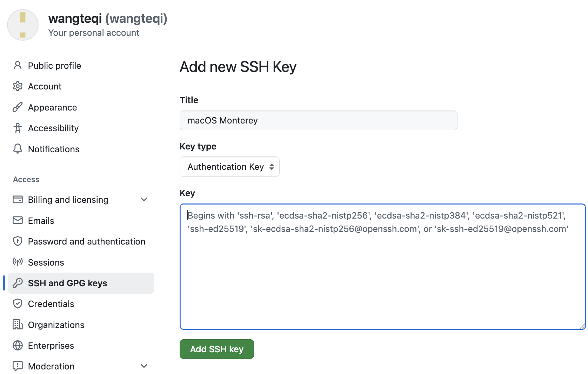

>2026.7.28
>
>王特起

# Git学习指南

## 配置Git

### 查看Git的版本

```shell
git --version
```

### 添加Git用户名和邮箱

```shell
# 查看
git config user.name
git config user.email

# 修改
git config --global user.name wangteqi
git config --global user.email 1591700776@qq.com
```

## Git基础

### 创建版本库

```shell
# 在某个文件夹下执行
git init
```

### 工作区，暂存区和本地仓库

- 添加工作区的文件修改到暂存区

    ```shell
    git add <file>
    ```

- 提交暂存区的内容到本地仓库

    ```shell
    git commit -m "<message>"
    ```

- 查看工作区，暂存区和本地仓库的状态

    ```shell
    git status
    ```

- 查看提交日志

    ```shell
    git log
    ```

### 版本回退

```shell
git reset --hard <commit>
```

## Git进阶

### Git指定要忽略的文件

- 在Git项目中定义`.gitignore`文件，例如：

    ```text
    # 日志文件（用*代替文件名）
    *.log
    
    # 需要继续追踪的日志文件（前面加！）
    !important.log
    
    # 私密图片文件夹
    image/
    ```

- 出现规则不生效的原因

    因为.gitignore只能忽略那些Untracked的文件，如果某些文件已经被纳入了版本管理中，则修改.gitignore是无效的。

    解决方法：删除本地缓存（改变成Untrack状态）

    ```shell
    git rm -r --cached .
    ```

### Git分支

- 创建并切换分支

    ```shell
    git switch -c <branch-name>
    ```

- 查看分支

    ```shell
    git branch -a
    ```

- 切换分支

    ```shell
    git switch <branch-name>
    ```

- 合并分支

    ```shell
    git merge <branch-name>
    ```

- 删除分支

    ```shell
    git branch -d <branch-name>
    ```

### 远程仓库

- 配置SSH连接

    在Github上创建[SSH keys](https://github.com/settings/keys)，点击 ==New SSH key==

    

    - Title：macOS Monterey

    - Key：在终端中执行下面的命令，将结果复制进去

        ```shell
        # 查看SSH 公钥
        cat ~/.ssh/id_rsa.pub
        
        # 如果没有结果，先生成
        ssh-keygen -o
        ```

- 上传本地仓库到代码托管平台

    - 初始化本地仓库

        ```shell
        git init
        ```

    - 添加远程仓库

        ```shell
        git remote add <my-repo-name> <my-repo-url>
        
        # 查看关联的远程仓库
        git remote -v
        ```

    - 从远程仓库拉取最新内容，并在main分支上合并最新内容

        ```shell
        git fetch <my-repo-name>
        git merge <my-repo-name>/main
        ```

    - 创建并切换到新分支

        ```shell
        git switch -c <branch-name>
        ```

    - 在新分支上修改、提交

        ```shell
        (branch-name) git status
        (branch-name) git add .
        (branch-name) git commit -m "<message>" 
        ```

    - 切换到main分支，并在main分支上合并新开发的分支功能

        ```shell
        git switch main
        git merge <branch-name>
        ```

    - 推送到远程仓库的main分支

        ```shell
        git push -u <my-repo-name> main
        ```

    - 删除本地分支

        ```shell
        git branch -d <branch-name>
        ```

- 团队项目

    - 克隆团队仓库到本地

        ```shell
        git clone <team-repo-url> --origin <team-repo-name>
        ```

    - fork团队仓库，添加fork后的远程仓库

        ```shell
        git remote add <my-repo-name> <my-repo-url>
        ```

    - 拉取团队仓库最新的内容，并将最新内容合并到main分支上

        ```shell
        git fetch -p <team-repo-name>
        git merge <team-repo-name>/main
        ```

    - 创建并切换到新分支

        ```shell
        git switch -c <branch-name>
        ```

    - 在新分支上修改、提交

        ```shell
        (branch-name) git status
        (branch-name) git add .
        (branch-name) git commit -m "<message>"
        ```

    - 再次拉取团队仓库最新内容，并合并到新分支

        ```shell
        (branch-name) git fetch -p <team-repo-name>
        (branch-name) git merge <team-repo-name>/main
        ```

    - 推送到远程仓库的远程分支

        ```shell
        (branch-name) git push -u <my-repo-name> <branch-name>
        ```

    - 提交PR请求通过后，更新本地仓库和远程fork的仓库

        ```shell
        git switch main 
        git fetch -p  <team-repo-name>
        git merge <team-repo-name>/main
        git push <my-repo-name> main
        ```

    - 删除本地分支和远程分支

        ```shell
        git branch -d <branch-name>
        git push <my-repo-name> --delete <branch-name>
        ```

        


