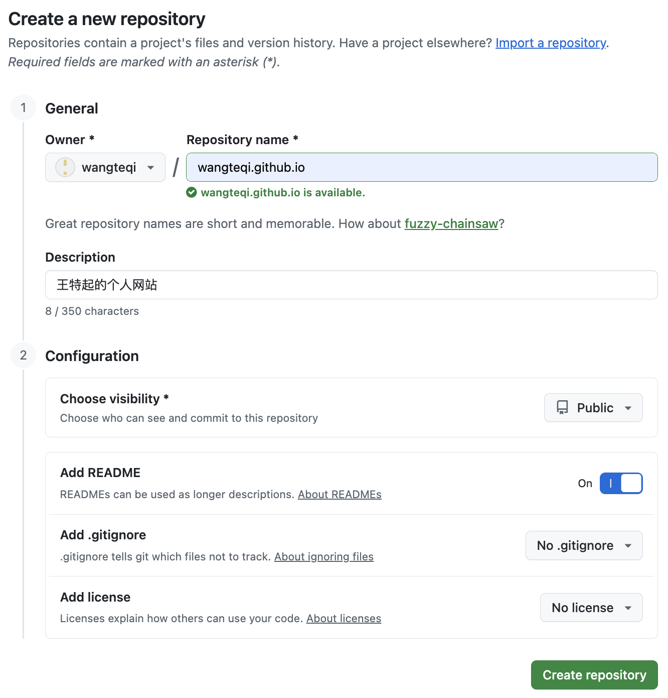
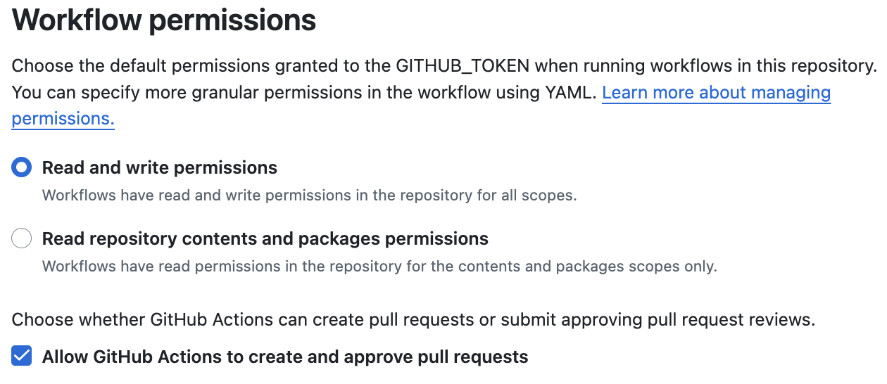
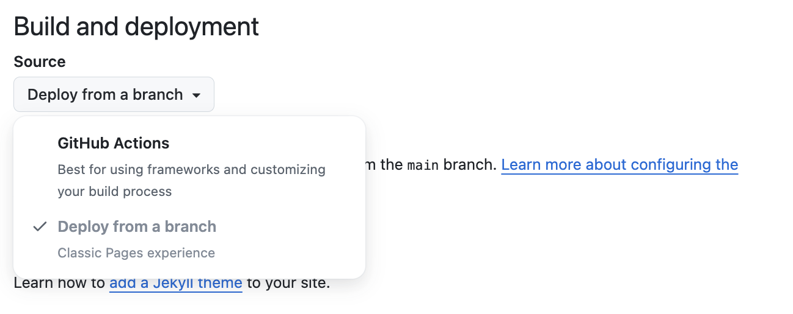

>2026.7.28
>
>王特起

# 个人网站搭建

## 配置Github仓库

### 创建Github仓库

- 设置Repository name：wangteqi.github.io
- 设置Description：[王特起的个人网站](www.baidu.com)
- 设置Configuration/Add README：On<button class="primary">按钮</button>



### Actions权限设置

在Github仓库 Settings/Actions/General/Workflow permisssions 中设置



### Pages设置

在Github仓库 Settings/Pages/Build and deployment/source 中选择 ==Github Actions==



## 使用Zensical搭建网站

### 安装Zensical

- 创建虚拟环境

    ```shell
    conda create -y -n zensical python=3.12
    ```
    
- 安装

    ```shell
    conda activate zensical
    pip3 install zensical
    ```

- 在PyCharm中初始化项目

    ```shell
    zensical new .
    ```

### 工作流文件

- 文件路径：./github/workflows/docs.yml

- 文件内容（在原始文件做了以下修改）

    - 修改工作流名称为 ==site-publish==
    - 删除触发条件中 ==master分支==
    - 添加 ==注释==

    ```yaml
    # 定义工作流名称
    name: site-publish
    # 触发条件，这个工作流会在每次向仓库main分支推送代码时触发
    on:
      push:
        branches:
          - main
    # 权限
    permissions:
      contents: read
      pages: write
      id-token: write
    # 构建工作流中的任务
    jobs:
      # 任务名称
      deploy:
        # 指定环境
        environment:
          name: github-pages
          url: ${{ steps.deployment.outputs.page_url }}
        # 指定了运行该任务的虚拟环境是最新版本的Ubuntu
        runs-on: ubuntu-latest
        # 执行步骤
        steps:
          - uses: actions/configure-pages@v6
          - uses: actions/checkout@v7
          - uses: actions/setup-python@v6
            with:
              python-version: 3.x
          - run: pip install zensical
          - run: zensical build --clean
          - uses: actions/upload-pages-artifact@v5
            with:
              path: site
          - uses: actions/deploy-pages@v5
            id: deployment
            
    ```

### Zensical配置文件

- 文件路径：./zensical.toml

- 文件内容

    ```toml
    [project]
    # 网站名称
    site_name = "王特起的个人网站"
    # 网站地址
    site_url = "https://wangteqi.github.io"
    # 网站说明
    site_description = "记录日常"
    # 网站作者
    site_author = "王特起"
    # Github仓库名称
    repo_name = "wangteqi/wangteqi.github.io"
    # Github仓库地址
    repo_url = "https://github.com/wangteqi/wangteqi.github.io"
    # css配置
    extra_css = ["assets/stylesheets/extra.css"]
    # JavaScript配置
    extra_javascript = [
        "assets/javascripts/mathjax.js",
        "https://unpkg.com/mathjax@3/es5/tex-mml-chtml.js"
    ]
    # 版权信息
    copyright = "Copyright &copy; 2026 ~ now  |  王特起"
    
    #######################################################################################################
    ##########################################平时修改部分###################################################
    # 显式导航
    nav = [
        { "首页" = "index.md" },
        { "开发技术" = [
            { "开发技术总览" = "dev/index.md" },
            { "操作系统与环境" = [
                { "macOS 配置" = "dev/system/macos.md" },
                { "Ubuntu 配置" = "dev/system/ubuntu.md" }
            ] },
            { "开发工具基础" = [
                { "Git 基础" = "dev/tools/git.md" },
                { "Linux 命令基础" = "dev/tools/linux.md" },
                { "Markdown 基础" = "dev/tools/markdown.md" },
                { "网站搭建基础" = "dev/tools/website.md" },
            ] },
        ] },
        { "个人研究" = [
            { "个人研究总览" = "research/index.md" },
            { "深度学习" = [
                { "服务器配置" = "research/deep-learning/server.md" },
                { "梯度下降算法" = "research/deep-learning/bp.md" },
                { "编程基础" = "research/deep-learning/program.md" },
                { "计算机视觉基础" = "research/deep-learning/cv.md" },
                { "自然语言基础" = "research/deep-learning/nlp.md" },
            ] },
            { "基础模型" = [
                { "开放词汇" = "research/basic-model/open-vocabulary.md" },
            ] },
            { "机器人策略学习" = [
                { "ACT 论文" = "research/robot-policy/act.md" },
                { "VITA 论文" = "research/robot-policy/vita.md" }
            ] },
            { "视觉—语言—动作模型" = [
                { "π0 论文" = "research/vla/π0.md" },
                { "π0.5 论文" = "research/vla/π0.5.md" }
            ] },
        ] },
        { "实验与复现" = [
            { "实验与复现总览" = "workbench/index.md" },
            { "图像编辑实验" = [
                { "AR 图像编辑" = "workbench/image-edit/edit.md" }
            ] },
            { "机械臂实验" = [
                { "reBot b601-DM 调试记录" = "workbench/robotics/rebot-b601-dm.md" }
            ] }
        ] },
        { "关于我" = [
            { "个人简介" = "me/index.md" },
            { "日常生活" = [
                { "课题研究思路" = "me/life/thesis-topic.md" },
                { "读论文的方法" = "me/life/paper-tips.md" },
            ] }
        ] }
    ]
    
    # 标签
    [project.extra.tags]
    development = "tags-development"
    server = "tags-server"
    [project.theme.icon.tag]
    default = "lucide/tag"
    tags-development = "fontawesome/solid/code"
    tags-server = "fontawesome/solid/server"
    ##########################################平时修改部分###################################################
    #######################################################################################################
    
    # 社交链接
    [[project.extra.social]]
    icon = "fontawesome/brands/github"
    link = "https://github.com/wangteqi"
    name = "github.com"
    [[project.extra.social]]
    icon = "fontawesome/brands/x-twitter"
    link = "https://x.com/teqiwang"
    name = "x.com"
    
    [project.theme]
    # 现代主题
    variant = "modern"
    # 网站语言
    language = "en"
    # 主题功能
    features = [
        # 页脚
        "navigation.footer",
        # 查看/编辑页面源码
        "content.action.view",
        "content.action.edit",
        # 页面切换
        "navigation.instant",
        "navigation.instant.prefetch",
        "navigation.instant.progress",
        # 顶部导航
        "navigation.tabs",
        # 导航结构
        "navigation.tracking",
        "navigation.sections",
        "navigation.path",
        "navigation.indexes",
        # 阅读体验
        "toc.follow",
        "navigation.top",
        # 搜索
        "search.highlight",
        # 选择/复制代码
        "content.code.select",
        "content.code.copy",
        # 同步内容选项卡
        "content.tabs.link",
        # 脚注悬浮提示
        "content.footnote.tooltips",
        # 悬浮提示
        "content.tooltips"
    ]
    
    # 跟随系统主题
    [[project.theme.palette]]
    media = "(prefers-color-scheme)"
    toggle.icon = "lucide/sun-moon"
    toggle.name = "Switch to light mode"
    # 浅色主题
    [[project.theme.palette]]
    media = "(prefers-color-scheme: light)"
    scheme = "default"
    toggle.icon = "lucide/sun"
    toggle.name = "Switch to dark mode"
    # 深色主题
    [[project.theme.palette]]
    media = "(prefers-color-scheme: dark)"
    scheme = "slate"
    toggle.icon = "lucide/moon"
    toggle.name = "Switch to system preference"
    
    # 字体
    [project.theme.font]
    text = "Noto Serif Simplified Chinese"
    code = "JetBrains Mono"
    
    # 图标
    [project.theme.icon]
    logo = "lucide/sparkles"
    repo = "fontawesome/brands/github-alt"
    view = "material/eye"
    edit = "material/pencil"
    
    # Markdown基础扩展
    [project.markdown_extensions.abbr]
    [project.markdown_extensions.admonition]
    [project.markdown_extensions.attr_list]
    [project.markdown_extensions.def_list]
    [project.markdown_extensions.footnotes]
    [project.markdown_extensions.md_in_html]
    [project.markdown_extensions.toc]
    title = "目录"
    permalink = "⚓︎"
    permalink_title = "Anchor link to this section"
    [project.markdown_extensions.toc.slugify]
    object = "pymdownx.slugs.slugify"
    kwds = { case = "lower" }
    [project.markdown_extensions.tables]
    # Markdown额外扩展
    [project.markdown_extensions.pymdownx.arithmatex]
    generic = true
    [project.markdown_extensions.pymdownx.blocks.caption]
    [project.markdown_extensions.pymdownx.betterem]
    [project.markdown_extensions.pymdownx.caret]
    [project.markdown_extensions.pymdownx.mark]
    [project.markdown_extensions.pymdownx.tilde]
    [project.markdown_extensions.pymdownx.details]
    [project.markdown_extensions.pymdownx.emoji]
    emoji_index = "zensical.extensions.emoji.twemoji"
    emoji_generator = "zensical.extensions.emoji.to_svg"
    [project.markdown_extensions.pymdownx.highlight]
    pygments_lang_class = true
    anchor_linenums = true
    line_spans = "__span"
    [project.markdown_extensions.pymdownx.inlinehilite]
    [project.markdown_extensions.pymdownx.keys]
    [project.markdown_extensions.pymdownx.smartsymbols]
    [project.markdown_extensions.pymdownx.snippets]
    auto_append = ["docs/assets/abbreviations.md"]
    [project.markdown_extensions.pymdownx.superfences]
    custom_fences = [
        { name = "mermaid", class = "mermaid", format = "pymdownx.superfences.fence_code_format" }
    ]
    [project.markdown_extensions.pymdownx.tabbed]
    alternate_style = true
    combine_header_slug = true
    [project.markdown_extensions.pymdownx.tabbed.slugify]
    object = "pymdownx.slugs.slugify"
    kwds = { case = "lower" }
    [project.markdown_extensions.pymdownx.tasklist]
    custom_checkbox = true
    ```
    
- 后续添加笔记

    - 显式导航部分按需添加，如果需要修改文档图标颜色，同时修改extra.css文件
    - 标签部分按需添加
    

### js文件配置

- 文件路径：./docs/assets/javascripts/mathjax.js

- 创建文件

    ```shell
    mkdir -p docs/assets/javascripts
    touch docs/assets/javascripts/mathjax.js
    ```

- 文件内容

    ```js
    // 支持数学公式
    window.MathJax = {
        tex: {
            inlineMath: [["\\(", "\\)"]],
            displayMath: [["\\[", "\\]"]],
            processEscapes: true,
            processEnvironments: true
        },
        options: {
            ignoreHtmlClass: ".*|",
            processHtmlClass: "arithmatex"
        }
    };
    
    document$.subscribe(() => {
        MathJax.startup.output.clearCache()
        MathJax.typesetClear()
        MathJax.texReset()
        MathJax.typesetPromise()
    })
    
    component$.subscribe(({ref}) => {
        if (ref.classList.contains("md-annotation"))
            MathJax.typesetPromise([ref])
    })
    ```

- 目前只用于支持数学公式

### css文件配置

- 文件路径：./docs/assets/stylesheets/extra.css

- 创建文件

    ```shell
    mkdir -p docs/assets/stylesheets
    touch docs/assets/stylesheets/extra.css
    ```

- 文件内容

    ```css
    /*logo图标颜色*/
    .md-header__button.md-logo,
    .md-nav__button.md-logo {
        color: #f59e0b;
    }
    
    /*repo图标颜色*/
    .md-header__source .md-source__icon,
    .md-nav__source .md-source__icon {
        color: #8b5cf6;
    }
    
    /*文档icon颜色*/
    .md-nav__link[href*="/git/"] svg {
        color: #bd09cb;
    }
    ```

- 目前只用于图标颜色修改

### 缩略词文件配置

- 文件路径：./docs/assets/abbreviations.md

- 创建文件

    ```shell
    touch docs/assets/abbreviations.md
    ```

- 文件内容

    ```markdown
    *[ACT]: Action Chunking with Transformers
    ```

- 用于术语表

### 使用Git推送代码

- 第一次发布

    - 创建gitignore文件

        ```shell
        touch .gitignore
        ```

        - 文件路径：./gitignore

        - 文件内容:

            ```shell
            # macos文件
            .DS_Store
            
            # pycharm文件
            .idea/
            ```

    - 初始化本地仓库

        ```shell
        git init
        ```

    - 添加远程仓库

        ```shell
        git remote add wtq git@github.com:wangteqi/wangteqi.github.io.git
        ```

    - 从远程仓库拉取最新内容，并在main分支上合并最新内容

        ```shell
        git fetch wtq
        git merge wtq/main
        ```

    - 在main分支上提交

        ```shell
        git status
        git add .
        git commit -m "Init site" 
        ```

    - 推送到远程仓库

        ```shell
        git push -u wtq main
        ```

- 添加内容后发布

    - 从远程仓库拉取最新内容，并在main分支上合并新内容

        ```shell
        git fetch wtq
        git merge wtq/main
        ```

    - 创建并切换到新分支

        ```shell
        git switch -c index
        ```

    - 添加新内容

        ```shell
        touch docs/index.md
        mkdir -p docs/dev
        touch docs/dev/index.md
        mkdir -p docs/research
        touch docs/research/index.md
        mkdir -p docs/workbench
        touch docs/workbench/index.md
        mkdir -p docs/me
        touch docs/me/index.md
        ```
        
    - 在新分支提交
    
        ```shell
        (index) git add .
        (index) git commit -m "Add index.md"
        ```
        
    - 切换到main分支，并在main分支上合并新分支添加的内容
    
        ```shell
        git switch main
        git merge index
        ```
        
    - 推送到远程仓库的main分支
    
        ```shell
        git push wtq main
        ```
        
    - 删除本地分支
    
        ```shell
        git branch -d index
        ```


