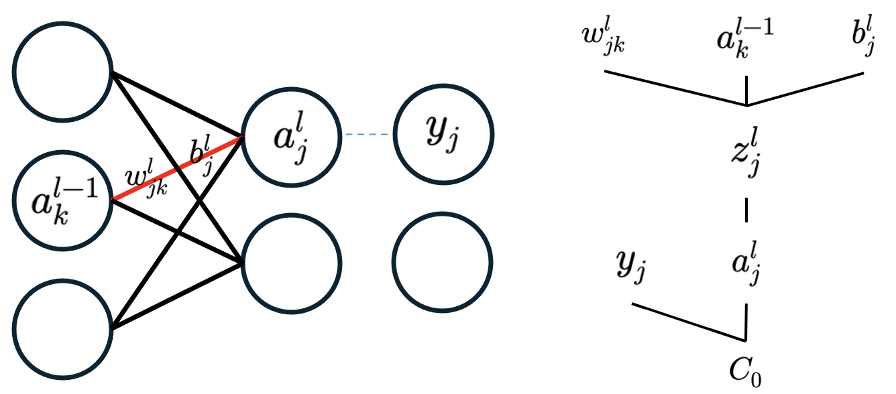

> 王特起
>
> 2017.1.1

# 梯度下降笔记

## 梯度下降的基本概念

==梯度下降==是一种一阶迭代优化算法，其用于寻找可微函数的局部最小值。

*通俗一点的解释就是：==梯度下降==是一种迭代技术，试图从初始随机猜测开始，为给定模型、数据点和损失函数找到最佳可能的模型参数。*

## 梯度下降的理解

### 数据

0. 训练——验证——测试拆分

    ==拆分==是永远要做的第一件事——没有预处理，没有转换。

1. 特征归一化

    在==拆分之后==执行，且==仅==使用==训练集==计算，并应用于所有数据集。

    实现方法：

    计算给定==特征==$x_{i}$的均值$\bar{X}$和标准差$\sigma \left( X \right)$，然后使用这两个值来==归一化==特征。

    **单位标准差**可以使==所有数值特征==具有==相似的比例==；**零均值**使==输入集中==在==零==处。
    $$
    \begin{gathered}\bar{X} =\frac{1}{N} \sum_{i=1}^{N} x_{i}\\ \sigma \left( X \right) =\sqrt{\frac{1}{N} \sum_{i=1}^{N} \left( x_{i}-\bar{X} \right)^{2}}\\ \tilde{x_{i}} =\frac{x_{i}-\bar{X}}{\sigma \left( X \right)}\end{gathered}
    $$

2. 对训练集数据进行==打乱==

    一般是在数据加载时打乱。验证集和测试集没有必要打乱，因为没有用来计算梯度。==时间序列==问题不能打乱，不然会导致数据泄露。

### 模型

具有==单个特征==的线性回归模型。
$$
y=b+wx+\epsilon
$$

### 五个步骤

0. 第0步——初始化

    - 参数的==随机==初始化
    - 超参数的初始化

1. 第1步——前向传递

    使用参数的==当前值==计算模型的预测$\hat y$。
    $$
    \hat y =b+wx
    $$

2. 第2步——计算损失

    根据计算损失所使用的数据点数量来划分==梯度下降类型==：

    - 批量梯度下降

        使用训练集中的==所有点$(n=N)$==来计算损失。

    - 小批量梯度下降

        ==介于1到$N$之间==的任何其他值$n$来计算。

    - 随机梯度下降

        使用==一个点$(n=1)$==计算。

    对于==回归==问题，==损失==由==均方误差(MSE)==计算，即所有误差平方的平均值。
    $$
    \text{MSE} = \frac{1}{n} \sum_{i=1}^{n} \left( \hat{y_{i}} -y_{i} \right)^{2}
    $$

3. 第3步——反向传播

    通过==链式法则==，基于==每个参数计算损失函数的梯度==，所以反向传播仅指计算梯度的算法。

    *梯度 = 如果==一个参数稍有==变化，==损失==会发生==多少==变化*
    $$
    \begin{gathered}\frac{\partial \text{MSE}}{\partial w} =\frac{\partial \hat{y_{i}}}{\partial w} \times \frac{\partial \text{MSE}}{\partial \hat{y_{i}}} =2\frac{1}{n} \sum_{i=1}^{n} x_{i}\left( \hat{y_{i}} -y_{i} \right)\\ \frac{\partial \text{MSE}}{\partial b} =\frac{\partial \hat{y_{i}}}{\partial b} \times \frac{\partial \text{MSE}}{\partial \hat{y_{i}}} =2\frac{1}{n} \sum_{i=1}^{n} \left( \hat{y_{i}} -y_{i} \right)\end{gathered}
    $$

4. 第4步——更新参数

    每个==参数==的值都将通过一个==超参数$\mu$（学习率）==更新，但这个常数值将根据==该参数对最小化损失的贡献程度（梯度）来加权==。
    $$
    \begin{gathered}w=w-\eta \frac{\partial \text{MSE}}{\partial w}\\ b=b-\eta \frac{\partial \text{MSE}}{\partial b}\end{gathered}
    $$
    学习率的大小受到==最陡曲线==的限制，可以通过==特征归一化==来让所有的曲线都==同样==陡峭。

5. 第5步——周期循环

    只要训练集$(N)$中每个点都已用于==所有步骤==：前向传递、计算损失、反向传播和更新参数，则形成一个周期。

    周期中的==更新次数==取决于所使用的梯度下降类型：

    - 批量梯度下降

        一个周期有一次更新

    - 小批量梯度下降

        一个周期有$\frac{N}{n}$次更新

    - 随机梯度下降

        一个周期有$N$次更新

## 深层模型的反向传播

### 深层模型的结构图



### 所有数据点的梯度

$$
\begin{gathered}\frac{\partial C}{\partial w_{jk}^{l}} =\frac{1}{n} \sum_{i=0}^{n-1} \frac{\partial C_{i}}{\partial w_{jk}^{l}}\\ C_{0}=\sum_{j=0}^{n_{l}-1} \left( a_{j}^{l}-y_{j} \right)^{2}\\ a_{j}^{l}=\sigma \left( z_{j}^{l} \right)\\ z_{j}^{l}=w_{jk}^{l}a_{k}^{l-1}+b_{j}^{l}\end{gathered}
$$

### 一个数据点的梯度计算

$$
\begin{aligned}\frac{\partial C_{0}}{\partial w_{jk}^{l}} =&\frac{\partial z_{j}^{l}}{\partial w_{jk}^{l}} \frac{\partial a_{j}^{l}}{\partial z_{j}^{l}} \frac{\partial C_{0}}{\partial a_{j}^{l}}\\ \frac{\partial C_{0}}{\partial a_{k}^{l-1}} =&\sum_{j=0}^{n_{l}-1} \frac{\partial z_{j}^{l}}{\partial a_{k}^{l-1}} \frac{\partial a_{j}^{l}}{\partial z_{j}^{l}} \frac{\partial C_{0}}{\partial a_{j}^{l}}\\ \frac{\partial C_{0}}{\partial b_{j}^{l}} =&\frac{\partial z_{j}^{l}}{\partial b_{j}^{l}} \frac{\partial a_{j}^{l}}{\partial z_{j}^{l}} \frac{\partial C_{0}}{\partial a_{j}^{l}}\end{aligned}
$$

## 算法代码

0. 模型

    ```python
    import numpy as np
    
    np.random.seed(42)
    # 数据
    ## 生成数据的模型
    true_b = 1
    true_w = 2
    N = 100
    x = np.random.rand(N, 1)
    epsilon = 0.1 * np.random.randn(N, 1)
    y = true_b + true_w * x + epsilon
    ```
    
1. 数据

    ```python
    ## 打乱
    idx = np.arange(N)
    np.random.shuffle(idx)
    
    ## 拆分
    train_idx, val_idx = idx[:int(0.8 * N)], idx[int(0.8 * N):]
    train_x, train_y = x[train_idx], y[train_idx]
    val_x, val_y = x[val_idx], y[val_idx]
    ```

2. 步骤

    ```python
    # 梯度下降的五个步骤
    ## 参数随机初始化
    b = np.random.rand(1)
    w = np.random.rand(1)
    ## 超参数初始化
    n_epochs = 1000
    lr = 0.1
    
    ## 周期循环
    for epoch in range(n_epochs):
        ## 前向传递
        yhat = w * train_x + b
    
        ## 计算损失
        loss = np.mean((yhat - train_y) ** 2)
    
        ## 反向传播
        w_grad = 2 * np.mean((yhat - train_y) * train_x)
        b_grad = 2 * np.mean(yhat - train_y)
    
        ## 更新参数
        w = w - lr * w_grad
        b = b - lr * b_grad
    
    print(b, w)
    ```

