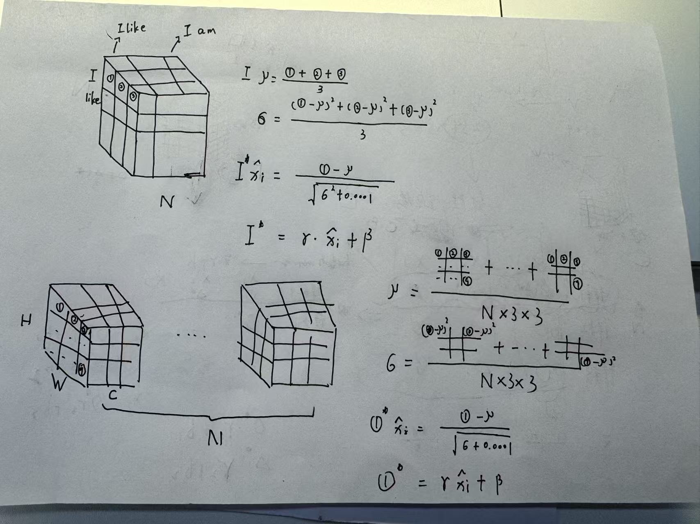

> 王特起
>
> 2017.4.1

# 视觉理论笔记

## 分类问题

### 逻辑斯蒂回归

给定==两个特征==$x_{1}$和$x_{2}$，该模型将拟合==线性回归==，使其输出为logit(z)，使用==Sigmoid函数==将其转换为==概率==。
$$
P\left( y=1 \right) =\sigma \left( z \right) =\sigma (b+w_{1}x_{1}+w_{2}x_{2})
$$

- 对数比值比函数

    将==概率==映射到==对数比值比==，且对称。==logit值就是对数比值比==。

- Sigmoid函数

    将==对数比值比==映射回==概率==
    
- 决策边界

    z等于0，就处于==决策边界==

### 二元交叉熵损失

0. 误差

    预测==接近1的概率==，当概率为1意味着==0损失==

    - $\text{正类误差}_{i}=\text{log}(P(y_{i}=1))$
    - $\text{负类误差}_{i}=\text{log}(1-P(y_{i}=1))$

1. 损失
    $$
    \text{BCE} \left( y \right) =-\frac{1}{N_{\text{正}}+N_{\text{负}}} \left[ \sum_{i=1}^{N_{\text{正}}} \text{log} \left( P\left( y_{i}=1 \right) \right) +\sum_{i=1}^{N_{\text{负}}} \text{log} \left( 1-P\left( y_{i}=1 \right) \right) \right]
    $$
    等价形式
    $$
    \text{BCE} \left( y \right) =-\frac{1}{N} \sum_{i=1}^{N} \left[ y_{i}\text{log} \left( P\left( y_{i}=1 \right) \right) +\left( 1-y_{i} \right) \text{log} \left( 1-P\left( y_{i}=1 \right) \right) \right]
    $$

2. 损失函数类

    - `nn.BCEWithLogitsLoss`

        最后一层==没有==Sigmoid层

    - 损失函数要确保==第一个参数是预测值==
    
    - 输入是==logit==，标签是==浮点数==

### 分类阈值

TODO

### 交叉熵损失

0. sofmax函数计算概率
    $$
    \text{softmax} \left( z_{i} \right) =\frac{e^{z_{i}}}{\sum\nolimits_{j}^{C-1} e^{z_{j}}}
    $$

1. 损失
    $$
    \text{CE} \left( y \right) =-\frac{1}{N_{0}+\cdots +N_{C-1}} \sum_{c=0}^{C-1} \sum_{i=1}^{N_{c}} \text{log} \left( P\left( y_{i}=c \right) \right)
    $$

2. 损失函数类

    - `nn.CrossEntropyloss()`

        最后一层==没有==LogSoftmax层

    - 输入是==logit==，标签是==长整形==

### 评价指标

0. 准确率

    正确预测的数量和该类数据点的数量

## 激活函数

仿射变化：线性变换$w^{T}x$+平移$b$，神经元==只能==进行仿射变化

决策边界：在==激活==特征空间的一条==直线==，在==原始==特征空间是一条==曲线==

激活函数是==非线性函数==，==扭曲和转动==特征空间得到==激活特征空间==，打破深层和浅层模型的==等价性==。

- Sigmoid激活函数
- TanH激活函数
- ReLU激活函数

## 卷积神经网络

### 卷积

0. 使用`nn.Conv2d()`定义卷积层

    - `in_chanels`定义输入通道数
    - `out_chanels`定义输出通道数
    - `kernel_size`定义卷积核大小
    - `stride`定义步幅
    - `padding`定义填充大小

1. 卷积后的形状
    $$
    \left( \frac{\left( h+2p \right) -f}{s} +1,\frac{\left( w+2p \right) -f}{s} +1 \right)
    $$
    若要保持卷积后图像==大小不变==，需要设置$p=\frac{f-1}{2} ,s=1$

### 池化

- 最大池化`nn.MaxPool2d()`
- 平均池化`nn.AvgPool2d()`

### 展平

- `nn.Flatten()`

### 丢弃

`nn.Dropout(p)`用来作==正则化器==，通过强制模型找到不止一种方法实现目标来==防止过拟合==。==验证==模式==没有==丢弃，所以需要==设置==模型模式。

### 恒等层

- `nn.Identity()`

### 1X1卷积

可以==减少==通道的数量，作为==降维层==使用。

### 批归一化和层归一化



0. 批归一化

    对于==每个通道==，计算==这个小批量下所有像素==的统计数据，然后执行==仿射变换==。

    - 上一层设置`bias = False`

    - 一般在激活函数==之前==使用

    - 使用`nn.BatchNorm2d(num_features)`进行归一化

        `num_features`参数必须与==输入的通道数==匹配

### 残差连接

引入==非线性==会导致无法学习==恒等函数==，引入残差连接可以==跳过==非线性。

*通俗一点的例子：对于==线性层+relu激活函数（$F(x)$）==，加入==残差($x$)==可以让==线性层==只学习到==产生负值==，然后负值经过relu激活函数会被==截断==，即拟合到==$F(x)=0$==，最终输出$F(x)+x$就会==恒等==于输入值。*

0. 残差网络
    - 为梯度返回原始层提供了==更短==的路径，防止深层网络的==梯度消失==
    - 需要==下采样==，保持相加图片的尺寸一致
    - 加入残差==之后==需要接激活函数，保证非线性

### 模型冻结

0. 冻结所有参数

    使用`param.requires_grad=False`==冻结==参数

### 梯度爆炸和梯度消失

0. 梯度消失

    对于深层模型，为==初始层==中的权重计算的==梯度==会==越来越小==，最后导致权重==不更新==。

    - 权重初始化

        - Kaiming初始化

            初始化权重`nn.init.kaiming.uniform_()`

            初始化偏差`nn.init.zeros_()`

        - 初始化函数的封装

            ```python
            def weights_init(m):
                if isinstance(m, nn.Linear):
                    nn.init.kaiming_uniform_(m.weight, nonlinearity='relu')
                    if m.bias is not None:
                        nn.init.zeros_(m.bias)
            ```

        - 应用初始化函数

            `model.apply(weights_init)`

    - 批归一化

1. 梯度爆炸

    对于深层模型，一个大的梯度可能会==不受控制增长==。

    - 梯度裁剪

        梯度裁剪发生在计算梯度==之后==，更新参数==之前==

        - 值裁剪

            `nn.utils.clip_grad_value_()`

            修改后的梯度方向==不同==

        - 范数裁剪

            `nn.utils.clip_grad_norm_()`

            ==保留==梯度向量的方向

    - 反向传播期间裁剪梯度

        因为普通梯度裁剪只会在==参数更新前==被裁剪，不适用于==循环神经网络==，所以需要使用钩子来裁剪梯度。

        ```python
        def set_clip_backprop(self, clip_value):
            if self.clipping is None:
                self.clipping = []
            for p in self.model.parameters():
                if p.requires_grad:
                    func = lambda grad: torch.clamp(grad, -clip_value, clip_value)
                    handle = p.register_hook(func)
                    self.clipping.append(handle)
        ```

## 钩子

### 输出钩子

0. 钩子函数接收的参数

    在钩子函数==外部==定义一个或多个==储存字典==来保存下面的信息：

    - 挂钩层
    - 挂钩层输入
    - 挂钩层输出

1. 钩子函数的内部处理

    ==挂钩层的名称==作为存储字典的键，==挂钩层的输出==作为存储字典的值。

2. 注册钩子函数，挂钩层输出

    使用`handles = layer.register_forward_hook()`将钩子函数和==对应层挂钩==，并将==挂钩层的句柄==保存在句柄字典中。==层名==作为键，==句柄==作为值。

3. `.remove()`移除注册的钩子

### 梯度钩子

0. 钩子函数接收的参数

    - 梯度

1. 钩子函数的内部处理

    ==挂钩参数的名称==作为字典的键，==挂钩参数的梯度==作为存储字典的值

2. 注册钩子函数，挂钩梯度

    使用`handles = param.registerhook()`将钩子函数和==对应参数梯度挂钩==，并将==挂钩参数的句柄==保存在字典中。==挂钩参数名==作为键，==句柄==为值。

### 参数钩子

0. 钩子函数接收的参数

    - 挂钩层
    - 挂钩层输入
    - 挂钩层输出

1. 钩子函数的内部处理

    ==挂钩参数的名称==作为字典的键，==挂钩参数的值==作为存储字典的值

2. 注册钩子函数，挂钩参数

    使用`handles = layer.register_forward_hook()`将钩子函数和==对应层挂钩==，然后记录==挂钩参数值==，并将==挂钩参数的句柄==保存在字典中。==挂钩参数名==为键，==句柄==为值。


